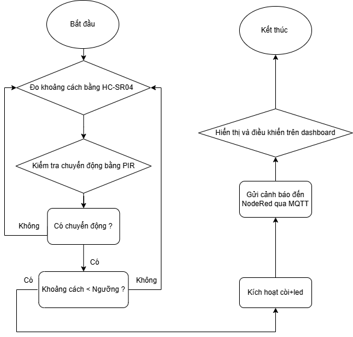

# Distance_Monitoring_Intrusion_Warning_System

## Tổng Quan
Dự án này là một "Hệ Thống Giám Sát Khoảng Cách và Cảnh Báo Xâm Nhập" được thiết kế nhằm nâng cao khả năng giám sát an ninh cho cửa ra vào và hành lang. Hệ thống sử dụng cảm biến siêu âm để đo khoảng cách các vật thể và cảm biến chuyển động PIR để phát hiện xâm nhập. Khi phát hiện có xâm nhập (phát hiện chuyển động và khoảng cách dưới một ngưỡng nhất định), hệ thống sẽ kích hoạt cảnh báo bằng còi và đèn LED, đồng thời gửi thông báo tới dashboard Node-RED qua giao thức MQTT.
Được lấy cảm hứng từ nhu cầu thực tế về bảo mật, sự phát triển của công nghệ IoT, và yêu cầu giám sát và phản ứng nhanh chóng trong các tình huống xâm nhập. Với mục tiêu bảo vệ an ninh và tài sản, dự án giúp cung cấp giải pháp an ninh dễ triển khai và hiệu quả cho các khu vực cần bảo vệ.

## Các Thành Phần Chính
- **Cảm Biến**:
  - **Cảm Biến Siêu Âm HC-SR04**: Đo khoảng cách của các vật thể trong phạm vi.
  - **Cảm Biến Chuyển Động PIR**: Phát hiện chuyển động để xác định xâm nhập.
- **Thiết Bị Cảnh Báo**:
  - **Buzzer**: Phát âm thanh cảnh báo xâm nhập ngay lập tức.
  - **Đèn LED**: Kết nối qua một điện trở, hiển thị cảnh báo bằng ánh sáng.
- **Vi Điều Khiển**:
  - **ESP32**: Kết nối với các cảm biến, xử lý dữ liệu, kích hoạt cảnh báo và giao tiếp với dashboard Node-RED qua MQTT.

## Cách Hoạt Động
1. **Phát Hiện Khoảng Cách và Chuyển Động**:
   - **Cảm Biến HC-SR04** đo khoảng cách các vật thể trong phạm vi.
   - **Cảm Biến PIR** phát hiện chuyển động trong khu vực giám sát.

2. **Logic Cảnh Báo Xâm Nhập**:
   - Khi cảm biến PIR phát hiện chuyển động và cảm biến siêu âm phát hiện một vật thể trong khoảng cách ngưỡng nhất định, hệ thống sẽ xác định đó là xâm nhập.
   - ESP32 sẽ kích hoạt còi và đèn LED để cảnh báo trực tiếp tại chỗ.
   - ESP32 cũng sẽ gửi thông báo cảnh báo qua **MQTT** tới dashboard Node-RED.

3. **Dashboard Node-RED**:
   - Hiển thị dữ liệu trực tiếp từ các cảm biến.
   - Hiển thị thông báo khi phát hiện xâm nhập.
   - Cho phép người dùng điều khiển bật/tắt còi và đèn LED từ xa.

## Ứng Dụng
Hệ thống này phù hợp cho việc giám sát an ninh tại cửa ra vào, hành lang, hoặc bất kỳ khu vực nào cần theo dõi chuyển động và khoảng cách. Ứng dụng có thể sử dụng trong các khu vực dân cư, thương mại, hoặc công nghiệp để cảnh báo người dùng về các xâm nhập không được phép.

## Sơ đồ thuật toán

## Kết quả dự án giữa kì 

